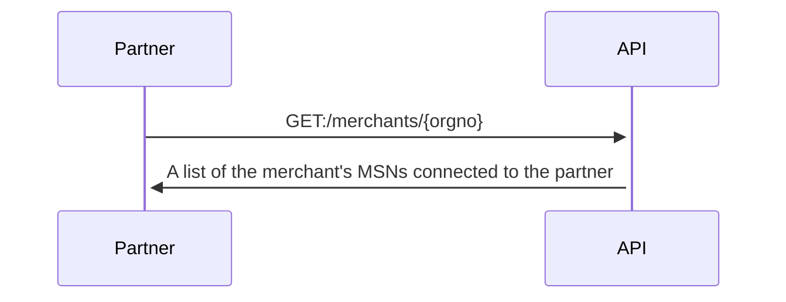
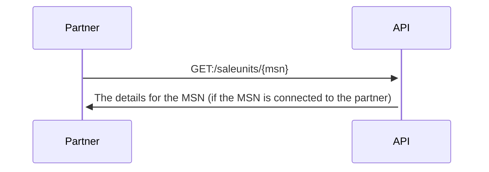
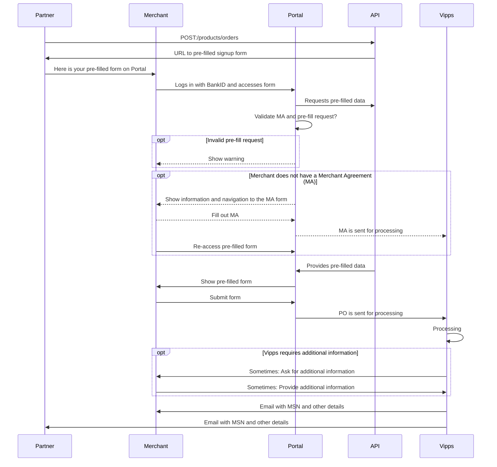

<!-- START_METADATA
---
title: API guide
sidebar_position: 30
---
END_METADATA -->

# API guide

<!-- START_COMMENT -->
💥 Please use the documentation pages here: <https://developer.vippsmobilepay.com/docs/APIs/partner-api>. 💥
<!-- END_COMMENT -->

**Important:** The
[Management API](https://developer.vippsmobilepay.com/docs/APIs/management-api/),
has replaced the Partner API: All the functionality in the Partner API is available in the Management API.
The upgrade effort will be minimal: The API keys are the same, and the endpoints,
requests and responses are *almost* identical.
The Management API is for both partners and merchants.
The Partner API will be phased out in Q4 2023.

The Partner API allows partners to retrieve information about their merchants and sales units by using partner keys.

API version: 1.0.0.

## Information for Vipps partners

* [How to become a Vipps partner](https://www.vipps.no/developer/become-a-partner/).
* [Vipps Partners](https://developer.vippsmobilepay.com/docs/partner): Technical information for Vipps partners.

### Integrating with this API

Integration should be straight-forward.
Use the
[partner keys](https://developer.vippsmobilepay.com/docs/partner/partner-keys).
See the Postman collection and environment, and the
[Quick start guide](vipps-partner-api-quick-start.md).

The Postman collection can also be used to manually make API calls,
even without an integration in place.

**Please note:** Vipps has limited capacity to handle partners' requests to
"just check something", even though it may be trivial. We therefore recommend
the following priority:

1. Integrate with the Partner API, so the functionality is made available
   in the partner's own admin interface.
2. Use the Partner API manually with the Postman collection provided by Vipps.
3. Ask the merchant to create a user for the partner on [portal.vipps.no](https://portal.vipps.no),
   so the partner can check on behalf of the merchant:
   [How to add a user on portal.vipps.no](https://developer.vippsmobilepay.com/docs/partner/add-portal-user).
4. See the Vipps FAQ for how to check if a sales unit
   [has skipLandingPage](https://developer.vippsmobilepay.com/docs/faqs/reserve-and-capture-faq#how-can-i-check-if-i-have-reserve-capture-or-direct-capture)
   or
   [which capture type it has](https://developer.vippsmobilepay.com/docs/faqs/reserve-and-capture-faq#how-do-i-turn-direct-capture-on-or-off).

**Important:** Endpoints with `/v0/` (version 0) in the URI *are* working, and
will continue to do so, but will be superseded by similar `/v1/` endpoints with
improved functionality as soon as possible. For example:
[`GET:/saleunits/{msn}`](https://developer.vippsmobilepay.com/api/partner#tag/Sales-units/operation/getMSN)
provides limited information about a sales unit today, but will provide more
details once the internal Vipps systems are able to provide them.
The response may then change more than we allow for in the
[API Lifecycle](https://developer.vippsmobilepay.com/docs/common-topics/api-lifecycle),
and we will therefore keep `/v0/` until `/v1/` is ready.

### Partner keys

All Partner Plus and Partner Premium partners can use their
[partner keys](https://developer.vippsmobilepay.com/docs/partner/partner-keys).
to use the Partner API. If you have partner keys, you have access to the
Partner API.

**Please note:** Some partners may need an internal Vipps update of their API
product package to get access. Contact your partner manager if you get errors
indicating this. Please double-check your partner keys first, though.

## Get information about a merchant based on organization number

**Important:** This endpoint is deprecated. Please use the Management API:
[`GET:/management/v1/merchants/{orgno}`](https://developer.vippsmobilepay.com/api/management/#tag/Merchants/operation/getMerchantByOrgno)
The Management API uses the same API keys as the Partner API.

This endpoint is for retrieving information about the merchant:

[`GET:/merchants/{orgno}`](https://developer.vippsmobilepay.com/api/partner#tag/Merchants/operation/getMerchant)

Sequence diagram:



The current version of the Partner API only returns a list of MSNs
connected to the partner making the API request, but we *may* extend this later.

The response (see
[`GET:/merchants/{orgno}`](https://developer.vippsmobilepay.com/api/partner#tag/Merchants/operation/getMerchant)
for details):

```json
{
  "msn": [
     "123456",
     "123457"
   ]
}
```

This is an endpoint for getting information about the *merchant*, not all the
merchant's MSNs.
Since the response only contains a list of MSNs, an additional API request is
required to get more details about the sales unit.
See:
[Get information about a sales unit based on MSN](#get-information-about-a-sales-unit-based-on-msn).

### Future improvements

Future versions of the API will *probably* return more information,
and we will work with our partners to find out what is useful and possible.
Some candidates:

* Company address
* Contact information for the main person (depends on GDPR, etc.)
* Contact information for the technical person (depends on GDPR, etc.)
* A list of people with admin rights on portal.vipps.no (depends on GDPR, etc.)
* Changelog: What was changed when by whom?

### In the meantime

All merchants can see and manage their information on
[portal.vipps.no](https://portal.vipps.no).
Merchants can also see which partner (or PSP) a sales unit is connected to, if any.

Merchants can create a user for their partner on
[portal.vipps.no](https://portal.vipps.no),
so the partner can do this directly as described here:
[Partner keys](https://developer.vippsmobilepay.com/docs/partner/partner-keys)
and
[How to add a user on portal.vipps.no](https://developer.vippsmobilepay.com/docs/partner/add-portal-user).

## Get information about a sales unit based on MSN

**Important:** This endpoint is deprecated. Please use the Management API:
[`GET:/management/v1/sales-units/{msn}`](https://developer.vippsmobilepay.com/api/management/#tag/Sales-units/operation/getMsn)
The Management API uses the same API keys as the Partner API.

This endpoint is for retrieving details about one sales unit (MSN):

[`GET:/saleunits/{msn}`](https://developer.vippsmobilepay.com/api/partner#tag/Sales-units/operation/getMSN)

Sequence diagram:



The response (see
[`GET:/saleunits/{msn}`](https://developer.vippsmobilepay.com/api/partner#tag/Sales-units/operation/getMSN)
for details):

```json
{
  "msn": "123456",
  "name": "ACME Fantastic Fitness",
  "orgno": "987654321",
  "additionalDetails": {
    "skipLandingPage": false,
    "isPureLogin": false,
    "captureType": "ReserveCapture",
    "recurring": false
  }
}
```

The `orgno` is included to make it possible to find out which merchant a MSN
belongs to, which is useful if only the MSN is known.

## Product order (PO) and Merchant agreement (MA)

Merchants must have both a valid Merchant Agreement (MA) and an approved
Product Order (PO) to be able to use Vipps products.

* MA: An agreement between the merchant and Vipps, signed with BankID.
  The MA contains information about all direct and indirect owners, any
  politically exposed persons, etc.
* PO: This is an order for "Vipps på nett", "Vipps Login", etc. The merchant
  must provide some information about the use, whether the cardholder is
  present, etc. The PO is not signed with BankID.
  A merchant may have several Vipps products, each created with a separate PO.

A merchant may order a Vipps product (submit a product order, "PO") with or
without an existing Merchant Agreement ("merchant agreement", "MA").

Both MA and PO are described in detail in
[Scenarios](#scenarios).

## Submit a product order for a merchant

**Important:** This endpoint is deprecated. Please use the Management API:
[`POST:/management/v1/product-orders`](https://developer.vippsmobilepay.com/api/management/#tag/Product-orders/operation/orderProduct)
The Management API uses the same API keys as the Partner API.

This endpoint lets a partner "pre-fill" the product order form on
[portal.vipps.no](https://portal.vipps.no)
on behalf of a merchant, so the merchant can log in, check the data, and submit
the product order:

[`POST:/products/orders`](https://developer.vippsmobilepay.com/api/partner#tag/Vipps-Product-Orders/operation/orderProduct)

### Sequence diagram for pre-fill

PO: Product order. MA: Merchant agreement.



### Request

Here is a sample request:

```json
{
  "orgno": "987654321",
  "salesUnitName": "ACME Fantastic Fitness",
  "salesUnitLogo": "VGhlIGltYWdlIGdvZXMgaGVyZQ==",
  "settlementAccountNumber": "86011117947",
  "pricePackageId": "8a11afb7-c223-48ed-8ca6-4722b97261aa",
  "productType": "VIPPS_PA_NETT",
  "productUseCase": "WebsiteWithTest",
  "annualTurnover": 100000,
  "intendedPurpose": "Gym membership for accessing the gym's facilities.\nGuest will be not physically present when buying the subscription,\nas that is done on the gym's website.",
  "website": {
    "url": "https://example.com",
    "termsUrl": "https://example.com/terms-and-conditions",
    "testWebsiteUrl": "https://example.com/test ",
    "testWebsiteUsername": "test-user",
    "testWebsitePassword": "test-password"
  },
  "complianceData": {
    "giftCard": {
      "isSalesPercentageLessThanTen": false,
      "validityDuration": "3 years",
      "giftCardTurnoverShare": "about 25%"
    },
    "membership": {
      "turnoverShare": "about 25%",
      "membershipValidity": "CurrentCalendarYear",
      "periodDistribution": "50% yearly 20% monthly"
    },
    "subscription": {
      "turnoverShare": "about 25%",
      "periodDistribution": "50% yearly 20% monthly"
    },
    "course": {
      "turnoverShare": "about 25%",
      "timeBeforeOrder": "10 days",
      "period": "once every 6. week",
      "isOnlineCourseOffered": false,
      "onlineAccessibleTime": "for 3 months"
    },
    "ticket": {
      "turnoverShare": "about 25%",
      "prepurchaseTime": "10 weeks"
    },
    "rent": {
      "turnoverShare": "about 25%",
      "prepurchaseTime": "15 days",
      "averageRentalDuration": "3 weeks"
    },
    "prepaidServices": {
      "turnoverShare": "about 25%",
      "prepurchaseTime": "10 weeks"
    },
    "donation": {
      "acceptsDonation": false
    }
  }
}
```

**Important:** Please provide all the required fields, so it will not be necessary for
merchants to request more details. This is the most
[typical reason for delays](https://developer.vippsmobilepay.com/docs/partner/#typical-reasons-for-delays).

We have made as many of the fields as possible optional, but please
try to send as much as possible, to make it easy for the merchant.

**Please note:** The merchant cannot change the partner name or price package. If
something needs to be corrected, they must contact the partner to have
them submit a new pre-fill product order with the correct details.

The response (see
[`POST:/products/orders`](https://developer.vippsmobilepay.com/api/partner#tag/Vipps-Product-Orders/operation/orderProduct)
for details):

```json
{
  "prefilledOrderId": "81b83246-5c19-7b94-875b-ea6d1114f099",
  "returnUrl": "https://portal.vipps.no/register/vippspanett/81b83246-5c19-7b94-875b-ea6d1114f099"
}
```

### Processing of the product order

When the submitted order has been processed, Vipps sends an email to both the
merchant and the partner (as described on
[Vipps Partners](https://developer.vippsmobilepay.com/docs/partner))
with information about:

* The merchant's organization number
* The merchant's name
* The sales unit's MSN
* The sales unit's name

This may be useful:
[Typical reasons for delays](https://developer.vippsmobilepay.com/docs/partner#typical-reasons-for-delays).

### Scenarios

**Please note:** The only method Vipps has to verify that a user has the right
to sign a merchant agreement for a merchant is by using data from
[Brønnøysundregistrene](https://brreg.no).
It is therefore a requirement that the user logging in on
[portal.vipps.no](https://portal.vipps.no)
is registered as chairman of the board ("styreleder") or CEO ("daglig leder").
The user will then automatically be presented with the pre-filled PO.

#### Scenario 1: The merchant does not have a Merchant Agreement

1. The partner pre-fills the PO using
   [`POST:/products/orders`](https://developer.vippsmobilepay.com/api/partner#tag/Vipps-Product-Orders/operation/orderProduct)
   and gets a URL to the pre-filled PO on
   [portal.vipps.no](https://portal.vipps.no).
   The partner provides the URL to the merchant.
2. The merchant uses the URL and logs in with BankID on
   [portal.vipps.no](https://portal.vipps.no).
3. The merchant is presented with a text informing them that they need to
   sign an MA before filling in the PO.
   The merchant is provided with a URL to the MA form, and the merchant must complete that
   to be able to continue with the PO.
4. After completing the MA form and submitting it,
   the merchant re-uses the URL to the pre-filled PO.
   The merchant sees the pre-filled PO with all details provided by the partner,
   checks the details in the PO, and submits it.
5. Vipps processes both the MA and PO and sends both the merchant and partner an
   email when done. The partner can also check with the API:
   [`GET:/merchants/{orgno}`](https://developer.vippsmobilepay.com/api/partner#tag/Merchants/operation/getMerchant).

When using the pre-fill link without a valid MA:


The most important part of the MA form is the "reelle rettighetshavere"
("real rights holders"), meaning the people with direct or direct ownership or
rights for the company. This is not something the partner can be expected to
know, and in any case this is information that must be signed with BankID by a
person that has signatory rights for the merchant. The form looks like this:


#### Scenario 2: The merchant has an active or processing Merchant Agreement

The merchant has a merchant agreement, and probably also a Vipps product.

1. The partner pre-fills the PO using
   [`POST:/products/orders`](https://developer.vippsmobilepay.com/api/partner#tag/Vipps-Product-Orders/operation/orderProduct)
   and gets a URL to the pre-filled PO on
   [portal.vipps.no](https://portal.vipps.no).
   The partner provides the URL to the merchant.
2. The merchant uses the URL and logs in with BankID on
   [portal.vipps.no](https://portal.vipps.no).
3. The merchant sees the pre-filled PO with all details provided by the partner,
   checks the details in the PO, and submits it.
4. Vipps processes the PO and sends both the merchant and partner an
   email when done. The partner can also check with the API:
  [`GET:/merchants/{orgno}`](https://developer.vippsmobilepay.com/api/partner#tag/Merchants/operation/getMerchant).


