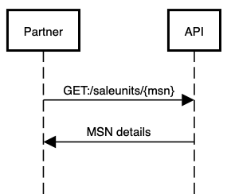
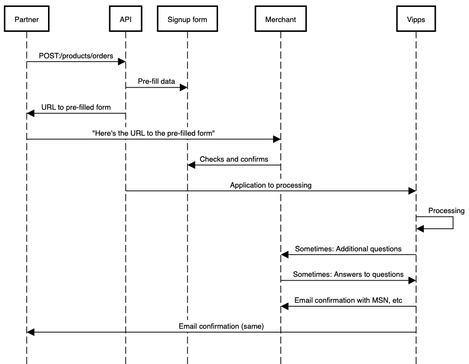
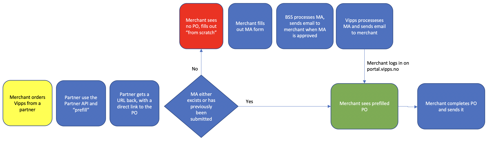

<!-- START_METADATA
---
title: API Guide
sidebar_position: 30
---
END_METADATA -->

# Vipps Partner API

<!-- START_COMMENT -->

ℹ️ Please use the new documentation:
[Vipps Technical Documentation](https://vippsas.github.io/vipps-developer-docs/).

<!-- END_COMMENT -->

The Vipps Partner API lets partners use their partner keys to retrieve information
about their merchants and their sale units.

API version: 1.0.0.

Document version 2.0.5.

<!-- START_TOC -->

## Table of contents

* [Information for Vipps partners](#information-for-vipps-partners)
  * [Integrating with this API](#integrating-with-this-api)
  * [Partner keys](#partner-keys)
* [Get information about a merchant based on organization number](#get-information-about-a-merchant-based-on-organization-number)
  * [Future improvements](#future-improvements)
  * [In the meantime](#in-the-meantime)
* [Get information about a sale unit based on MSN](#get-information-about-a-sale-unit-based-on-msn)
  * [Future improvements](#future-improvements)
  * [In the meantime](#in-the-meantime)
* [Submit a product order for a merchant](#submit-a-product-order-for-a-merchant)
  * [Scenarios](#scenarios)
    * [Flowchart](#flowchart)
    * [Scenario 1: The merchant does not have a Merchant Agreement](#scenario-1-the-merchant-does-not-have-a-merchant-agreement)
    * [Scenario 2: The merchant has a Merchant Agreement that is being processed](#scenario-2-the-merchant-has-a-merchant-agreement-that-is-being-processed)
    * [Scenario 3: The merchant has a Merchant Agreement](#scenario-3-the-merchant-has-a-merchant-agreement)
  * [Future improvements](#future-improvements)
* [Future plans for this API](#future-plans-for-this-api)
* [Questions?](#questions)

<!-- END_TOC -->

## Information for Vipps partners

- [How to become a Vipps partner](https://vipps.no/developer/bli-partner/) (in Norwegian).
- [Vipps Partners](https://vippsas.github.io/vipps-developer-docs/docs/vipps-partner/): Technical information for Vipps partners.

### Integrating with this API

Integration should be straight-forward.
Use the
[partner keys](https://vippsas.github.io/vipps-developer-docs/docs/vipps-partner/partner-keys).
See the Postman collection and environment, and the
[Quick start guide](vipps-partner-api-quick-start.md).

The Postman collection can also be used to manually make API calls,
even without an integration in place.

**Please note:** Vipps has limited capacity to handle partners' requests to
"just check something", even though it may be trivial. We therefore recommend
the following priority:

1. Integrate with the Partner API, so the functionality is made available
   in the partner's own admin interface.
2. Use the Partner API manually with the Postman collection provided by Vipps.
3. Ask the merchant to create a user for the partner on portal.vipps.no,
   so the partner can check on behalf of the merchant:
   [How to add a user on portal.vipps.no](https://github.com/vippsas/vipps-partner/blob/main/add-portal-user.md).
4. See the eCom FAQ for how to check if a sale unit
   [has skipLandingPage](https://github.com/vippsas/vipps-ecom-api/blob/master/vipps-ecom-api-faq.md#how-can-i-check-if-i-have-reserve-capture-or-direct-capture)
   or
   [which capture type it has](https://github.com/vippsas/vipps-ecom-api/blob/master/vipps-ecom-api-faq.md#how-do-i-turn-direct-capture-on-or-off).

### Partner keys

All partners can use their
[partner keys](https://vippsas.github.io/vipps-developer-docs/docs/vipps-partner/partner-keys).
to use the Partner API. If you have partner keys, you have access to the
Partner API.

**Please note:** Some partners may need an internal Vipps update of their API
product package to get access. Contact your partner manager if you get errors
indicating this. Please double check your partner keys first, though.

## Get information about a merchant based on organization number

[`GET:/merchants/{orgno}`](https://vippsas.github.io/vipps-developer-docs/api/partner#tag/Merchants/operation/getMerchant)

This endpoint is for retrieving information about the merchant.

Sequence diagram:


The current version of the Partner API only returns a list of MSNs
connected to the partner making the API request, but we _may_ extend this later.

The response (see the Swagger spec for details):

```json
{
  "msn": [
     "123456",
     "123457"
   ]
}
```

This is an endpoint for getting information about the _merchant_, not all the
merchant's MSNs.
Since the response only contains a list of MSNs, an additional API request is
required to get more details about the sale unit.
See:
[Get information about a sale unit based on MSN](#get-information-about-a-sale-unit-based-on-msn).

### Future improvements

Future versions of the API will _probably_ return more information,
and we will work with our partners to find out what is useful and possible.
Some candidates:

- Company address
- Contact information for the main person (depends on GDPR, etc)
- Contact information for the technical person (depends on GDPR, etc)
- A list of people with admin rights on portal.vipps.no (depends on GDPR, etc)
- Changelog: What was changed when by who?

### In the meantime

All merchants can see and manage their information on
[portal.vipps.no](https://portal.vipps.no).
Merchants can also see which partner (or PSP) a sale unit is connected to, if any.

Merchants can create a user for their parter on
[portal.vipps.no](https://portal.vipps.no),
so the partner can do this directly as described here:
[Partner keys](https://vippsas.github.io/vipps-developer-docs/docs/vipps-partner/partner-keys)
and
[How to add a user on portal.vipps.no](https://github.com/vippsas/vipps-partner/blob/main/add-portal-user.md).

## Get information about a sale unit based on MSN

[`GET:/saleunits/{msn}`](https://vippsas.github.io/vipps-developer-docs/api/partner#tag/Sales-units/operation/getMSN)

This endpoint is for retrieving details about one sale unit (MSN).

Sequence diagram:



The response (see the Swagger spec for details):

```json
{
  "msn": "123456",
  "name": "ACME Fantastic Fitness",
  "orgno": "987654321",
  "additionalDetails": {
    "skipLandingPage": false,
    "isPureLogin": false,
    "captureType": "ReserveCapture",
    "recurring": false
  }
}
```

The `orgno` is included to make it possible to find out which merchant a MSN
belongs to, which is useful if only the MSN is known.

### Future improvements

Future versions of the API will _probably_ return more information,
and we will work with our partners to find out what is useful and possible.
Some candidates:

- Vipps products: Which Vipps products and APIs are available for this MSN ("eCom API", "Recurring API", "Login API", etc).
- Transaction cost (price package)
- Status: Active or deactivated

### In the meantime

Until more functionality is available in this API, there are some workarounds:

- [How can I check if I have "reserve capture" or "direct capture"?](https://github.com/vippsas/vipps-ecom-api/blob/master/vipps-ecom-api-faq.md#how-can-i-check-if-i-have-reserve-capture-or-direct-capture)
- [How can I check if I have skipLandingPage activated?](https://github.com/vippsas/vipps-ecom-api/blob/master/vipps-ecom-api-faq.md#how-can-i-check-if-i-have-skiplandingpage-activated)

## Submit a product order for a merchant

**Important:** This endpoint is available for all partners in the
production environment, but there may be some minor changes. We will do our
utmost to avoid breaking changes, but we can not guarantee it.
As mentioned in the
[README](https://github.com/vippsas/vipps-partner-api/blob/main/README.md):
This is a new API, so feedback is welcome!
Please try to use GitHub's
[issue](https://github.com/vippsas/vipps-partner-api/issues)
functionality, so we can avoid multiple parallel discussions in various channels.

[`POST:/products/orders`](https://vippsas.github.io/vipps-developer-docs/api/partner#tag/Vipps-Product-Orders/operation/orderProduct)

This endpoint lets a partner "prefill" the product order form on
[portal.vipps.no](https://portal.vipps.no)
on behalf of a merchant, so the merchant can log in, check the data, and submit
the product order.

When the submitted order has been processed, Vipps sends an email to both the
merchant and the partner, as described on
[Vipps Partners](https://github.com/vippsas/vipps-partner).

Sequence diagram:



Here is a sample request:

```json
{
  "orgno": "987654321",
  "salesUnitName": "ACME Fantastic Fitness",
  "salesUnitLogo": "VGhlIGltYWdlIGdvZXMgaGVyZQ==",
  "settlementAccountNumber": "86011117947",
  "pricePackageKey": "posstandard",
  "productType": "VIPPS_PA_NETT",
  "mcc": "5200",
  "annualTurnover": "100000",
  "intendedPurpose": "Gym membership",
  "website": {
    "url": "https://example.com",
    "termsUrl": "https://example.com/terms-and-conditions",
    "testWebSiteUrl": "https://test.example.com",
    "testWebsiteUsername": "test-user",
    "testWebsitePassword": "test-password"
  }
}
```

**Please note:** The merchant can not change the information provided by the partner, so if
something needs to be corrected, the merchant must contact the partner to have
the partner submit a new product order with the correct details.
For instance: The partner name and the price package name is displayed, but can not be changed.

It is important for the partner to send in correct information for `pricePackageKey` in the request.
It the price package _name_ name such as "standard", "price1", etc. that must be used,
not the three-digit `priceId`.
If the correct `pricePackageKey` is not sent in the request,
the product order form in the merchant portal will not be prefilled when the
merchant logs in using the `returnUrl`, and the merchant can the4n select
from all the partner's prices.
We are working on simplifying this in the future.

This may be useful:
[Typical reasons for delays](https://github.com/vippsas/vipps-partner/blob/main/README.md#typical-reasons-for-delays).

### Scenarios

In order to get approved to have a product ("Vipps på nett", "Vipps Login", etc)
with Vipps, the merchant must first have a formal agreement with Vipps, called
the Merchant Agreement (MA).

Merchants need both a Merchant Agreement (MA) and a Product Order (PO) to
be able to accept Vipps payments:
* MA: An agreement between the merchant and Vipps, signed with BankID.
  The MA contains information about all direct and indirect owners, any
  politically exposed persons, etc.
* PO: This is an order for "Vipps på nett", "Vipps Login", etc. The merchant
  must provide some information about the use, whether the cardholder is
  present, etc. The PO is not signed with BankID.
  A merchant may have several Vipps products, each created with a separate PO.

A merchant may order a Vipps product (submit a product order, "PO") with or
without an existing Merchant Agreement ("merchant agreement", "MA").
Both MA and PO are described in detail in
[Scenarios](#scenarios).

**Please note:** The only method Vipps has to verify that a user has the right
to sign a MA for a merchant is by using data from
[Brønnøysundregistrene](https://brreg.no).
It is therefore a requirement that the user logging in on
[portal.vipps.no](https://portal.vipps.no)
is registered as chairman of the board ("styreleder") or CEO ("daglig leder").
The user will then automatically be presented with the prefilled PO.

#### Flowchart



#### Scenario 1: The merchant does not have a Merchant Agreement

1. The partner prefills the PO using
   [`POST:/products/orders`](https://vippsas.github.io/vipps-developer-docs/api/partner#tag/Vipps-Product-Orders/operation/orderProduct)
   and gets a link to the prefilled PO on
   [portal.vipps.no](https://portal.vipps.no).
2. The merchant user uses the link and logs in with BankID on
   [portal.vipps.no](https://portal.vipps.no).
3. The merchant is presented with the form for the MA,
   completes and submits the MA for processing.
4. Vipps processes the MA.
   **Important:** The merchant must wait until the MA
   is processed before it is possible to
   see the prefilled PO and submit that.
   Vipps sends an email when the MA is processed.
5. The merchant logs in on
   [portal.vipps.no](https://portal.vipps.no)
   and is presented with the prefilled PO,
   checks the details in the PO and submits it.
6. Vipps processes the PO and sends both the merchant and partner an
   email when done. The partner can also check with the API:
   [`GET:/merchants/{orgno}`](https://vippsas.github.io/vipps-developer-docs/api/partner#tag/Merchants/operation/getMerchant).

#### Scenario 2: The merchant has a Merchant Agreement that is being processed

The merchant has (very) recently submitted a MA, but Vipps has not
completed processing of it.
This is the same as scenario 1: The merchant is now on step 4.

#### Scenario 3: The merchant has a Merchant Agreement

The merchant has a MA, and probably also a Vipps product.

1. The partner prefills the PO using
   [`POST:/products/orders`](https://vippsas.github.io/vipps-developer-docs/api/partner#tag/Vipps-Product-Orders/operation/orderProduct)
   and gets a link to the prefilled PO on
   [portal.vipps.no](https://portal.vipps.no).
2. The merchant user uses the link and logs in with BankID on
   [portal.vipps.no](https://portal.vipps.no).
3. The merchant is presented with the prefilled PO,
   checks the details in the PO and submits it.
4. Vipps processes the PO and sends both the merchant and partner an
   email when done. The partner can also check with the API:
  [`GET:/merchants/{orgno}`](https://vippsas.github.io/vipps-developer-docs/api/partner#tag/Merchants/operation/getMerchant).

### Future improvements

* We aim to handle alle the scenarios above in the same way: The partner
  only uses the
  [`POST:/products/orders`](https://vippsas.github.io/vipps-developer-docs/api/partner#tag/Vipps-Product-Orders/operation/orderProduct),
  and Vipps handles all the details.
* Depending on legal requirements we want to let the partner know as much as
  possible about "their" merchants and sale units.  
* We may allow the merchant to change some of the data prefilled by the
  partner, but this is not trivial. If the merchant changes any data, the
  partner must be notified and also get the updated data - then merge and sync that
  with the "old" data that was sent in the first place.

## Future plans for this API

Changes to a sale unit currently requires BankID login to
[portal.vipps.no](https://portal.vipps.no)
but a partner should be able to make changes to the sale units connected to
the partner.

Some candidates:

- Status: Deactivate and activate MSNs
- Name: Update
- Capture type: Change from "reserve capture" or "direct capture"
- Skip landing page: Activate or deactivate
- Price: Update
- Logo: Update

In the meantime:
Merchants can create a user for their parter on
[portal.vipps.no](https://portal.vipps.no),
so the partner can do this directly
as described here:
[Partner keys](https://github.com/vippsas/vipps-partner#partner-keys)
and
[How to add a user on portal.vipps.no](https://github.com/vippsas/vipps-partner/blob/main/add-portal-user.md).

## Questions?

We're always happy to help with code or other questions you might have!
Please create an [issue](https://github.com/vippsas/vipps-api-api/issues),
a [pull request](https://github.com/vippsas/vipps-partner-api/pulls),
or [contact us](https://github.com/vippsas/vipps-developers/blob/master/contact.md).

Sign up for our [Technical newsletter for developers](https://github.com/vippsas/vipps-developers/tree/master/newsletters).
