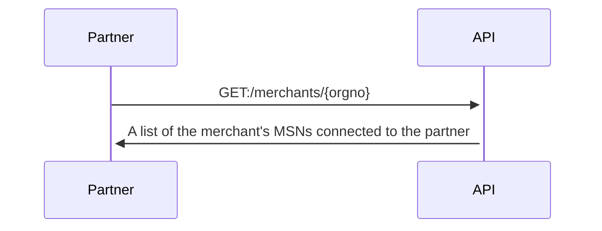
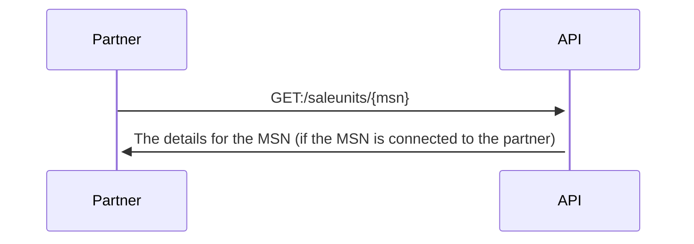
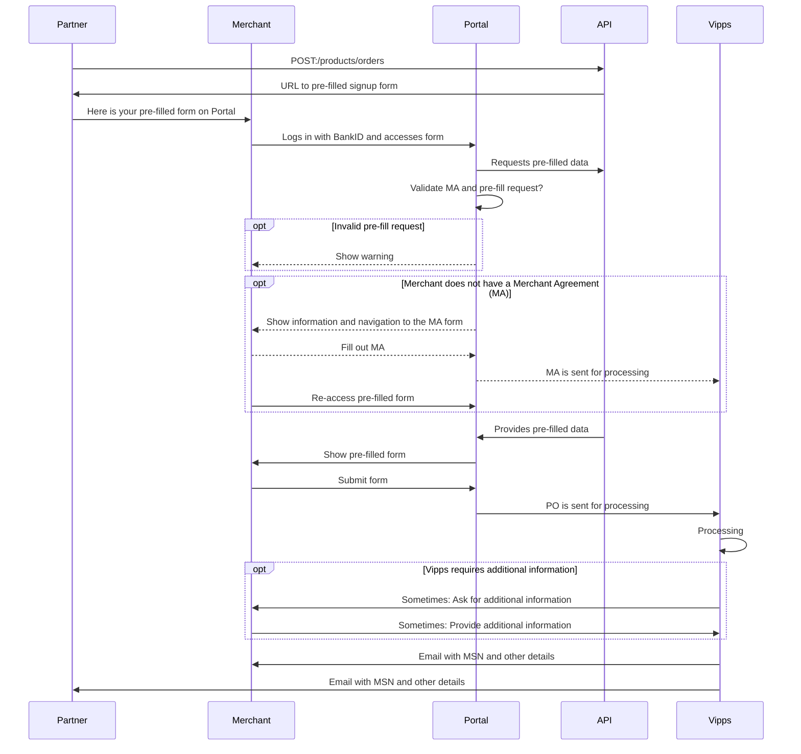

<!-- START_METADATA
---
title: API guide
sidebar_position: 30
---
END_METADATA -->

# API guide

The Vipps Partner API allows you, as a partner, to retrieve information about your merchants and sale units by using your partner keys.

API version: 1.0.0.

<!-- START_COMMENT -->

ℹ️ Please use the new documentation:
[Vipps Technical Documentation](https://vippsas.github.io/vipps-developer-docs/).

<!-- END_COMMENT -->

## Information for Vipps partners

* [How to become a Vipps partner](https://vipps.no/developer/bli-partner/) (in Norwegian).
* [Vipps Partners](https://vippsas.github.io/vipps-developer-docs/docs/vipps-partner): Technical information for Vipps partners.

### Integrating with this API

Integration should be straight-forward.
Use the
[partner keys](https://vippsas.github.io/vipps-developer-docs/docs/vipps-partner/partner-keys).
See the Postman collection and environment, and the
[Quick start guide](vipps-partner-api-quick-start.md).

The Postman collection can also be used to manually make API calls,
even without an integration in place.

**Please note:** Vipps has limited capacity to handle partners' requests to
"just check something", even though it may be trivial. We therefore recommend
the following priority:

1. Integrate with the Partner API, so the functionality is made available
   in the partner's own admin interface.
2. Use the Partner API manually with the Postman collection provided by Vipps.
3. Ask the merchant to create a user for the partner on portal.vipps.no,
   so the partner can check on behalf of the merchant:
   [How to add a user on portal.vipps.no](https://vippsas.github.io/vipps-developer-docs/docs/vipps-partner/add-portal-user).
4. See the Vipps FAQ for how to check if a sale unit
   [has skipLandingPage](https://vippsas.github.io/vipps-developer-docs/docs/vipps-developers/faqs/reserve-and-capture-faq#how-can-i-check-if-i-have-reserve-capture-or-direct-capture)
   or
   [which capture type it has](https://vippsas.github.io/vipps-developer-docs/docs/vipps-developers/faqs/reserve-and-capture-faq#how-do-i-turn-direct-capture-on-or-off).

**Important:** Endpoints with `/v0/` (version 0) in the URI _are_ working, and
will continue to do so, but will be superseded by similar `/v1/` endpoints with
improved functionality as soon as possible. For example:
[`GET:/saleunits/{msn}`](https://vippsas.github.io/vipps-developer-docs/api/partner#tag/Sales-units/operation/getMSN)
provides limited information about a sale unit today, but will provide more
details once the internal Vipps systems are able to provide them.
The response may then change more than we allow for in the
[API Lifecycle](https://vippsas.github.io/vipps-developer-docs/docs/vipps-developers/common-topics/api-lifecycle),
and we will therefore keep `/v0/` until `/v1/` is ready.

### Partner keys

All partners can use their
[partner keys](https://vippsas.github.io/vipps-developer-docs/docs/vipps-partner/partner-keys).
to use the Partner API. If you have partner keys, you have access to the
Partner API.

**Please note:** Some partners may need an internal Vipps update of their API
product package to get access. Contact your partner manager if you get errors
indicating this. Please double check your partner keys first, though.

## Get information about a merchant based on organization number

This endpoint is for retrieving information about the merchant:

[`GET:/merchants/{orgno}`](https://vippsas.github.io/vipps-developer-docs/api/partner#tag/Merchants/operation/getMerchant)

Sequence diagram:



The current version of the Partner API only returns a list of MSNs
connected to the partner making the API request, but we _may_ extend this later.

The response (see
[`GET:/merchants/{orgno}`](https://vippsas.github.io/vipps-developer-docs/api/partner#tag/Merchants/operation/getMerchant)
for details):

```json
{
  "msn": [
     "123456",
     "123457"
   ]
}
```

This is an endpoint for getting information about the _merchant_, not all the
merchant's MSNs.
Since the response only contains a list of MSNs, an additional API request is
required to get more details about the sale unit.
See:
[Get information about a sale unit based on MSN](#get-information-about-a-sale-unit-based-on-msn).

### Future improvements

Future versions of the API will _probably_ return more information,
and we will work with our partners to find out what is useful and possible.
Some candidates:

* Company address
* Contact information for the main person (depends on GDPR, etc)
* Contact information for the technical person (depends on GDPR, etc)
* A list of people with admin rights on portal.vipps.no (depends on GDPR, etc)
* Changelog: What was changed when by who?

### In the meantime

All merchants can see and manage their information on
[portal.vipps.no](https://portal.vipps.no).
Merchants can also see which partner (or PSP) a sale unit is connected to, if any.

Merchants can create a user for their partner on
[portal.vipps.no](https://portal.vipps.no),
so the partner can do this directly as described here:
[Partner keys](https://vippsas.github.io/vipps-developer-docs/docs/vipps-partner/partner-keys)
and
[How to add a user on portal.vipps.no](https://vippsas.github.io/vipps-developer-docs/docs/vipps-partner/add-portal-user).

## Get information about a sale unit based on MSN

This endpoint is for retrieving details about one sale unit (MSN):

[`GET:/saleunits/{msn}`](https://vippsas.github.io/vipps-developer-docs/api/partner#tag/Sales-units/operation/getMSN)

Sequence diagram:



The response (see
[`GET:/saleunits/{msn}`](https://vippsas.github.io/vipps-developer-docs/api/partner#tag/Sales-units/operation/getMSN)
for details):

```json
{
  "msn": "123456",
  "name": "ACME Fantastic Fitness",
  "orgno": "987654321",
  "additionalDetails": {
    "skipLandingPage": false,
    "isPureLogin": false,
    "captureType": "ReserveCapture",
    "recurring": false
  }
}
```

The `orgno` is included to make it possible to find out which merchant a MSN
belongs to, which is useful if only the MSN is known.

### Future improvements

Future versions of the API will _probably_ return more information,
and we will work with our partners to find out what is useful and possible.
Some candidates:

* Vipps products: Which Vipps products and APIs are available for this MSN ("eCom API", "Recurring API", "Login API", etc).
* Transaction cost (price package)
* Status: Active or deactivated

### In the meantime

Until more functionality is available in this API, there are some workarounds:

* [How can I check if I have "reserve capture" or "direct capture"?](https://vippsas.github.io/vipps-developer-docs/docs/vipps-developers/faqs/reserve-and-capture-faq#how-can-i-check-if-i-have-reserve-capture-or-direct-capture)
* [How can I check if I have skipLandingPage activated?](https://vippsas.github.io/vipps-developer-docs/docs/vipps-developers/faqs/vipps-landing-page-faq#how-can-i-check-if-i-have-skiplandingpage-activated)

## Product order (PO) and Merchant agreement (MA)

Merchants must have both a valid Merchant Agreement (MA) and an approved
Product Order (PO) to be able to use Vipps products.

* MA: An agreement between the merchant and Vipps, signed with BankID.
  The MA contains information about all direct and indirect owners, any
  politically exposed persons, etc.
* PO: This is an order for "Vipps på nett", "Vipps Login", etc. The merchant
  must provide some information about the use, whether the cardholder is
  present, etc. The PO is not signed with BankID.
  A merchant may have several Vipps products, each created with a separate PO.

A merchant may order a Vipps product (submit a product order, "PO") with or
without an existing Merchant Agreement ("merchant agreement", "MA").

Both MA and PO are described in detail in
[Scenarios](#scenarios).

## Submit a product order for a merchant

This endpoint lets a partner "pre-fill" the product order form on
[portal.vipps.no](https://portal.vipps.no)
on behalf of a merchant, so the merchant can log in, check the data, and submit
the product order:

[`POST:/products/orders`](https://vippsas.github.io/vipps-developer-docs/api/partner#tag/Vipps-Product-Orders/operation/orderProduct)

**Important:** This endpoint is available for all partners in the
production environment, but there may be some minor changes. We will do our
utmost to avoid breaking changes, but we can not guarantee it.
This is a new API, so feedback is welcome!
Please try to use GitHub's
[issue](https://github.com/vippsas/vipps-partner-api/issues)
functionality, so we can avoid multiple parallel discussions in various channels.

### Sequence diagram for pre-fill

PO: Product order. MA: Merchant agreement.



Here is a sample request:

```json
{
  "orgno": "987654321",
  "salesUnitName": "ACME Fantastic Fitness",
  "salesUnitLogo": "VGhlIGltYWdlIGdvZXMgaGVyZQ==",
  "settlementAccountNumber": "86011117947",
  "pricePackageId": "8a11afb7-c223-48ed-8ca6-4722b97261aa",
  "productType": "VIPPS_PA_NETT",
  "mcc": "5200",
  "annualTurnover": "100000",
  "intendedPurpose": "Gym membership",
  "website": {
    "url": "https://example.com",
    "termsUrl": "https://example.com/terms-and-conditions",
    "testWebSiteUrl": "https://test.example.com",
    "testWebsiteUsername": "test-user",
    "testWebsitePassword": "test-password"
  }
}
```

The response (see
[`POST:/products/orders`](https://vippsas.github.io/vipps-developer-docs/api/partner#tag/Vipps-Product-Orders/operation/orderProduct)
for details):

```json
{
  "prefilledOrderId": "81b83246-5c19-7b94-875b-ea6d1114f099",
  "returnUrl": "https://portal.vipps.no/register/vippspanett/81b83246-5c19-7b94-875b-ea6d1114f099"
}
```

**Please note:** The merchant can not change the information provided by the partner, so if
something needs to be corrected, the merchant must contact the partner to have
the partner submit a new product order with the correct details.

**Important:** It is important that the partner sends correct information for
`pricePackageId` in the request.
It's the UUID price package _id_ (`pricePackageId`) that must be used,
not the three-digit `priceId` or the alphanumeric key `pricePackageKey`.
If the `pricePackageId` is included but incorrect,
the `returnUrl` will take the merchant to a page warning them that the pre-fill
is not valid.

When the submitted order has been processed, Vipps sends an email to both the
merchant and the partner (as described on
[Vipps Partners](https://vippsas.github.io/vipps-developer-docs/docs/vipps-partner))
with information about:

* The merchant's organization number
* The merchant's name
* The sale unit's MSN
* The sale unit's name

This may be useful:
[Typical reasons for delays](https://vippsas.github.io/vipps-developer-docs/docs/vipps-partner#typical-reasons-for-delays).

### Scenarios

**Please note:** The only method Vipps has to verify that a user has the right
to sign a MA for a merchant is by using data from
[Brønnøysundregistrene](https://brreg.no).
It is therefore a requirement that the user logging in on
[portal.vipps.no](https://portal.vipps.no)
is registered as chairman of the board ("styreleder") or CEO ("daglig leder").
The user will then automatically be presented with the pre-filled PO.

#### Scenario 1: The merchant does not have a Merchant Agreement

1. The partner pre-fills the PO using
   [`POST:/products/orders`](https://vippsas.github.io/vipps-developer-docs/api/partner#tag/Vipps-Product-Orders/operation/orderProduct)
   and gets a link to the pre-filled PO on
   [portal.vipps.no](https://portal.vipps.no).
2. The merchant uses the link and logs in with BankID on
   [portal.vipps.no](https://portal.vipps.no).
3. The merchant is presented with a page informing them that they need to
   sign an MA before filling in the PO.
4. The merchant re-uses the link or finds the link to the pre-filled form on the
   front page on
   [portal.vipps.no](https://portal.vipps.no)
   and is presented with the pre-filled PO,
   checks the details in the PO and submits it.
5. Vipps processes the PO and sends both the merchant and partner an
   email when done. The partner can also check with the API:
   [`GET:/merchants/{orgno}`](https://vippsas.github.io/vipps-developer-docs/api/partner#tag/Merchants/operation/getMerchant).

When using the pre-fill link without a valid MA:


The most important part of the MA form is the "reelle rettighetshavere"
("real rights holders"), meaning the people with direct or direct ownership or
rights for the company. This is not something the partner can be expected to
know, and in any case this is information that must be signed with BankID by a
person that has signatory rights for the merchant. The form looks like this:


#### Scenario 2: The merchant has a active or processing Merchant Agreement

The merchant has a MA, and probably also a Vipps product.

1. The partner pre-fills the PO using
   [`POST:/products/orders`](https://vippsas.github.io/vipps-developer-docs/api/partner#tag/Vipps-Product-Orders/operation/orderProduct)
   and gets a link to the pre-filled PO on
   [portal.vipps.no](https://portal.vipps.no).
2. The merchant uses the link and logs in with BankID on
   [portal.vipps.no](https://portal.vipps.no).
3. The merchant is presented with the pre-filled PO,
   checks the details in the PO and submits it.
4. Vipps processes the PO and sends both the merchant and partner an
   email when done. The partner can also check with the API:
  [`GET:/merchants/{orgno}`](https://vippsas.github.io/vipps-developer-docs/api/partner#tag/Merchants/operation/getMerchant).

### Future improvements

* We aim to handle all the scenarios above in the same way: The partner
  only uses the
  [`POST:/products/orders`](https://vippsas.github.io/vipps-developer-docs/api/partner#tag/Vipps-Product-Orders/operation/orderProduct),
  and Vipps handles all the details.
* Depending on legal requirements we want to let the partner know as much as
  possible about "their" merchants and sale units.  
* We may allow the merchant to change some of the data pre-filled by the
  partner, but this is not trivial. If the merchant changes any data, the
  partner must be notified and also get the updated data - then merge and sync that
  with the "old" data that was sent in the first place.

## Future plans for this API

Changes to a sale unit currently requires BankID login to
[portal.vipps.no](https://portal.vipps.no),
but a partner should be able to make changes to the sale units connected to
the partner.

Some candidates:

- Status: Deactivate and activate MSNs
- Name: Update
- Capture type: Change from "reserve capture" or "direct capture"
- Skip landing page: Activate or deactivate
- Price: Update
- Logo: Update

In the meantime:
Merchants can create a user for their partner on
[portal.vipps.no](https://portal.vipps.no),
so the partner can do this directly
as described here:
[Partner keys](https://vippsas.github.io/vipps-developer-docs/docs/vipps-partner/partner-keys)
and
[How to add a user on portal.vipps.no](https://vippsas.github.io/vipps-developer-docs/docs/vipps-partner/add-portal-user).
